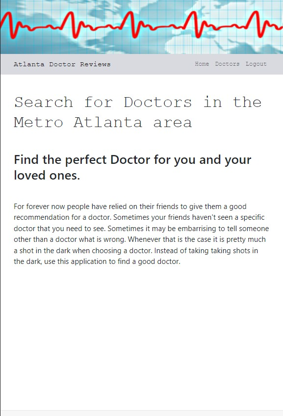
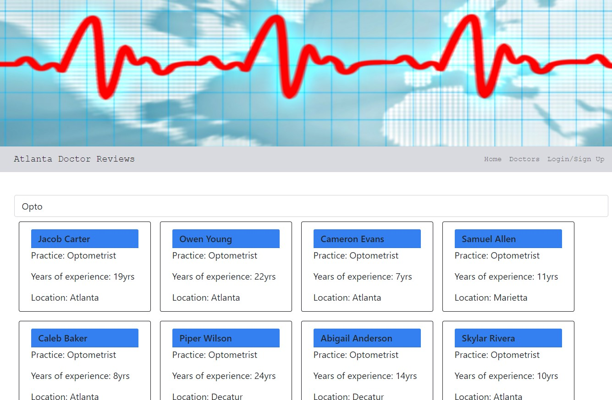
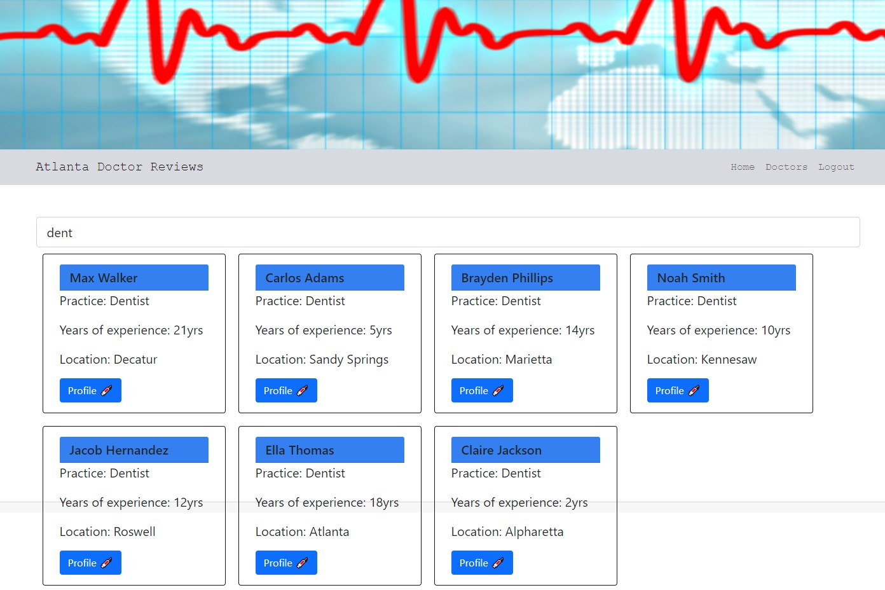
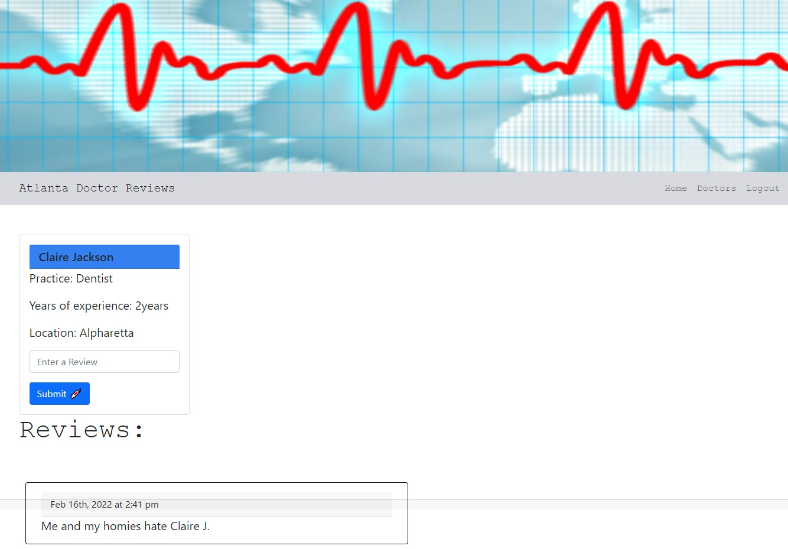

# Doctor Review

## Table of Contents

- [Description](#description)
- [User-Story](#user-story)
- [Installation](#installation)
- [Deployed](#deployed)
- [Demonstration](#demonstration)
- [Built-With](#built-with)
- [Contributing](#contributing)

## Description

Have you ever wanted to find a doctor in your area who fits the correct practice you're in need of or wanted to see reviews on a doctor in your area you were unsure about. Worry not because now you can find this information quickly and easily. This application is an easy to use review site for Doctors, specifically for this application, in the Atlanta Metropolitan area. With it you can look up doctors by practice and from there you are able to view and post reviews to that doctors page so long as you are logged in/ signed up. 

## User Story
```md
As a patient
I want to search for doctors based off type of practice and reviews
So that I can choose the right doctor for myself or my loved ones
```

## Installation

Install

```
npm i
```

Run

```
npm run develop
```

## Deployed 

https://arcane-stream-32047.herokuapp.com/

## Demonstration



<br/>



<br/>



<br/>



## Built With

- ReactJS
- MongoDB
- GraphQL

## Contributing

- Kevin Elmore

- Roberto Buzeta

- Joshua Samples